# Image Distortion Simulation
 This project aims to simulate various visual distortions to improve the robustness and reliability of **Monocular SLAM (Simultaneous Localization and Mapping)** systems. SLAM is a technology that allows robots and autonomous systems to understand their surroundings using only a single camera. However, in the real world, cameras often operate under different environmental conditions, leading to visual distortions.

This project simulates common visual distortions, such as **Raindrop**, **Mud**, **Noise**, **Motion Blur**, and **Lens Blur**, to test how SLAM algorithms perform under these conditions.

---

## Example Images

Below are example images for each category of visual distortion. These images represent the effects of each distortion type and are used to test how SLAM algorithms perform under such conditions.

### Raindrop Category

Images in this category:

  

    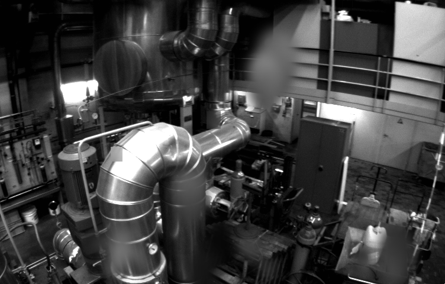
    
Raindrop20

  

  

    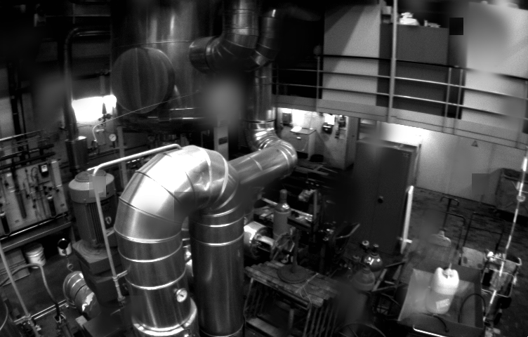
    
Raindrop35

  

  

    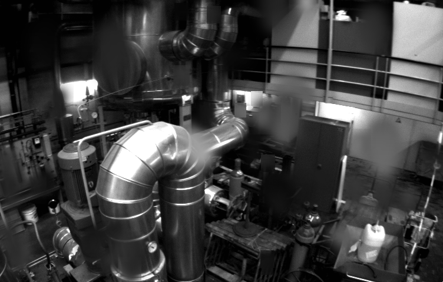
    
Raindrop50

  

### Mud Category

Images in this category:

  

    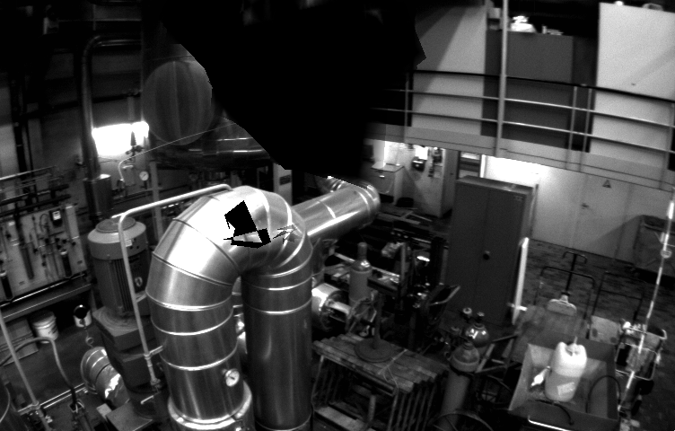
    
Mud130

  

  

    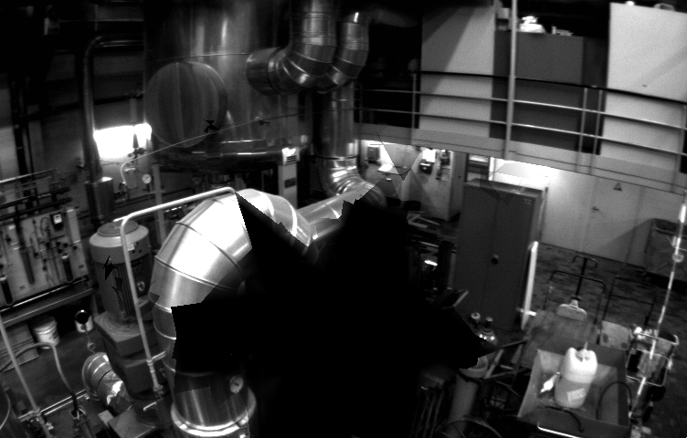
    
Mud180

  

  

    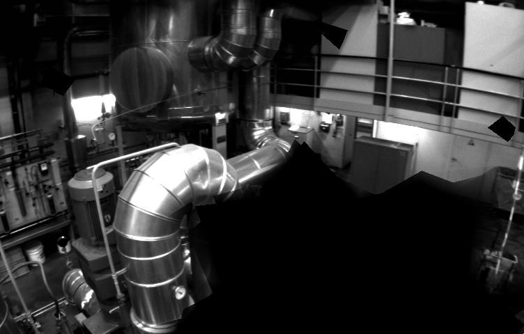
    
Mud230

  

### Noise Category

Images in this category:

  

    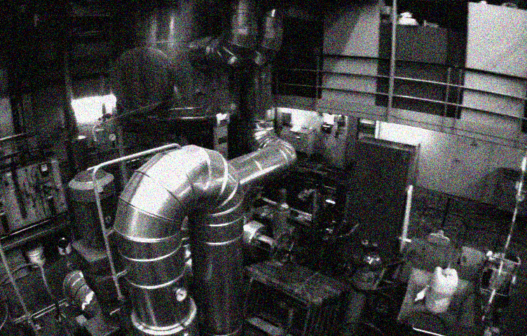
    
Noise2000

  

  

    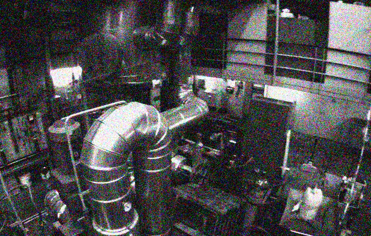
    
Noise3000

  

  

    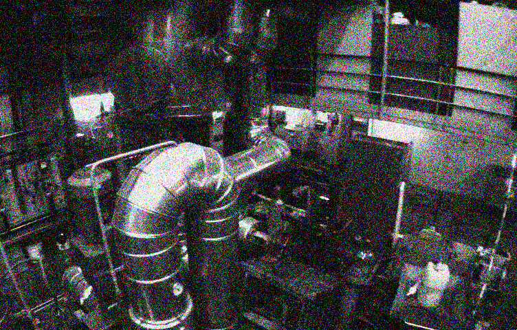
    
Noise4000

  

### Motion Blur Category

Images in this category:

  

    
    
MotionBlur15

  

  

    
    
MotionBlur20

  

  

    
    
MotionBlur25

  

### Lens Blur Category

Images in this category:

  

    
    
LensBlur52

  

  

    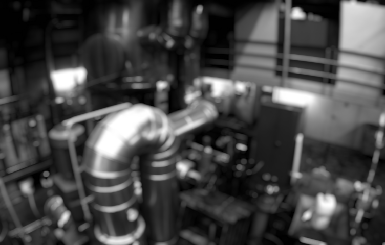
    
LensBlur63

  

  

    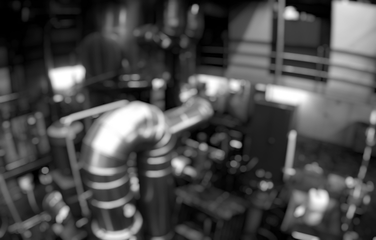
    
LensBlur74

  

---

## Conclusion

The images presented above represent examples of various types of visual distortions. These images have been generated as part of this project to simulate real-world environmental conditions that could affect SLAM algorithms. The purpose of this simulation is to evaluate how well SLAM systems perform under different types of distortions such as raindrops, mud, noise, motion blur, and lens blur.

These images are intended as sample data to test and improve the robustness of monocular SLAM algorithms under challenging visual conditions.
